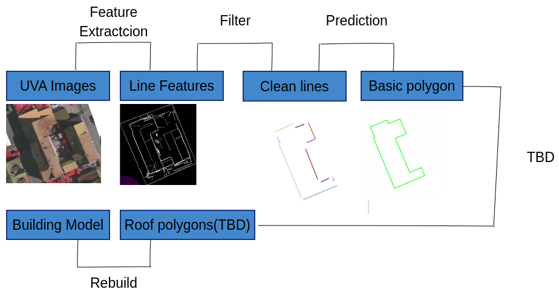

# Buiding Extraction
## 1. What's it？
&ensp;&ensp;This is a method to extract buildings in UAV images with a rough mask border prediction provided by point-cloud or CNN result. This program is now in developing under [Dream_BIG]() group, and the developers can join this for more details.
## 2. The pipeline of Build-Extract

- Extract lines in UAV Image.
- Filter the noise with rough mask or point-cloud.
- Predict the un-tracked lines.
- E-C(extract and classify) the inside lines for whole roof rebuild.
- Rebuild 3D-wireframe model.

## 3. Dependency
- [OpenCV 3.XX ](https://pan.baidu.com/s/1Vm0TK5JDuFM0zj81Thdasw) (file-code:rpvd)
- [Gdal 2.XX](https://pan.baidu.com/s/1UT3rxCP66Czx1Dun4xNJYQ) (file-code:xqqk)
- [Eigen 3.XX](https://pan.baidu.com/s/19_58E-3PKd-bs7-nbN6R7w) (file-code:re9b)
- [PCL 1.11](https://pan.baidu.com/s/14zDoalpt7JcLA-j7XLw5kA) (file-code:mgif)
  - VTK 8.2.0
  - boost 
  - Flann

## 4. Exp-Data
- [uav images](https://pan.baidu.com/s/19EZl3WRQHebIPi3WMfGxrQ) (file-code:pvgd)
- [point-cloud](https://pan.baidu.com/s/1jNif1r5aWR1537pi4Y3YFw) (file-code:4g6k)
  
